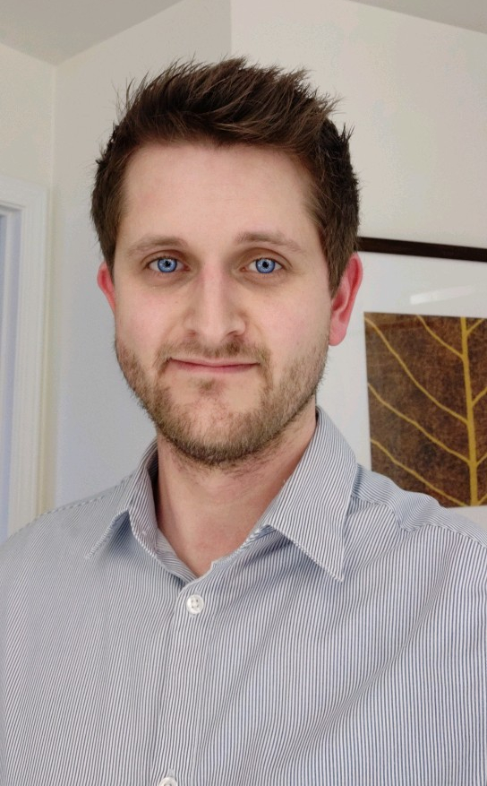

## Hi world, my name ist Martin

I did my master's at the KIT and currently work as a research scientist. I like to deal with all kinds and shapes of Artificial Intelligence (I hate acronyms). 
It brings me joy if there is something to program, so reach out if you have got an idea!

Recent leisure projects
* finding ways to fight off the spread of false information and "fake news"
* learning some front-end-related disciplines

    

